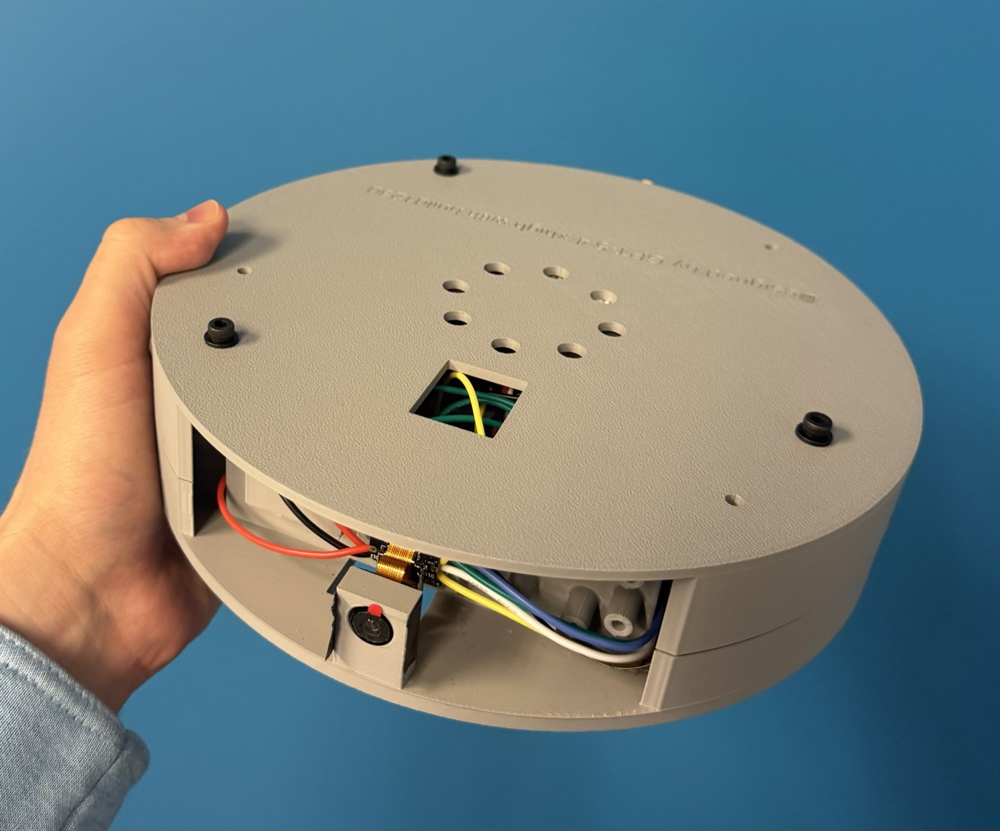
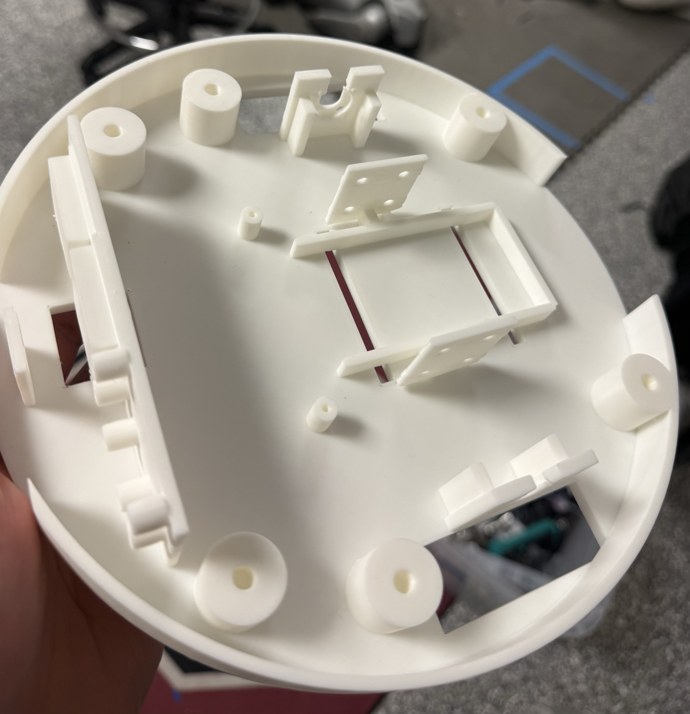
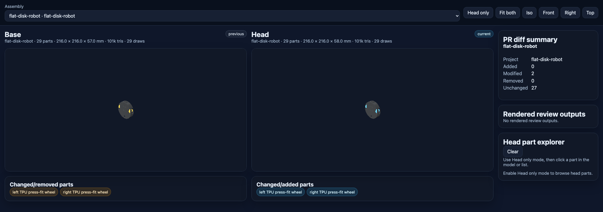

# SynthCAD

SynthCAD is a small `build123d` CAD workflow for generating, inspecting, and
exporting 3D-printable robotics parts from Python.

This open-source extraction contains the flat disk robot reference project and
a low-resolution demo FTC robot planning project.

## Demo

Photos of the physical robot and printed chassis details:

| Built flat disk robot | Printed chassis internals |
| --- | --- |
|  |  |

## Quick Start

```bash
uv run synthcad-build --project flat-disk-robot
uv run synthcad-probe --target flat-disk-robot --children
uv run synthcad-inspect --target flat-disk-robot
uv run show-interference --target flat-disk-robot
uv run synthcad-urdf --target flat-disk-robot
```

Generated STEP, STL, GLB, inspection, and URDF artifacts are written under
`projects/flat-disk-robot/generated/`, which is intentionally ignored by git.
`synthcad-inspect` writes the exact hidden-line projection plus a fast
colorized `*-detail.svg` overview with direct-child labels and sizes.

## Build Targets

- `flat-disk-robot-chassis`: printable 216 mm chassis.
- `flat-disk-robot-lid`: printable service lid.
- `flat-disk-robot`: reference assembly with motors, wheels, electronics,
  sensors, battery, and lid.
- `demo-ftc-robot`: color-coded CrayonPlan concept assembly for an FTC DECODE
  robot with six-wheel drive, intake, indexer, and flywheel shooter.

The source references used by the flat disk robot live under
`projects/flat-disk-robot/real-parts/`. BREP cache files may be generated
beside STEP inputs during local builds; they are ignored and should not be
committed.

## GitHub CI

`.github/workflows/synthcad-ci.yml` detects the changed project scope, runs the
shared tests plus selected project-local tests, exports selected CAD, generates
inspection evidence, writes a Markdown Actions summary, and uploads the selected
`projects/<project>/generated/` review artifacts. On pull requests it also
publishes a static base/head CAD diff viewer for the selected assembly target(s)
and updates a PR comment with the visualization and workflow links.

Example: [PR #1 CAD review comment](https://github.com/BenCaunt/SynthCAD/pull/1#issuecomment-4373932308).



## Agent Skills

This repository can be used with `vercel-labs/skills`:

```bash
npx skills add BenCaunt/SynthCAD --list
npx skills add BenCaunt/SynthCAD --skill synthcad-cad-authoring
npx skills add BenCaunt/SynthCAD --skill synthcad-crayon-plan
npx skills add BenCaunt/SynthCAD --skill synthcad-setup-github-project
```

Skill sources are in `skills/`. The repo intentionally does not include a root
`SKILL.md`, so skill installers copy only the selected skill directory instead
of the whole CAD repository.

## Validation

Run the regression suite:

```bash
uv run pytest
```

For geometry changes, regenerate exports and inspect the affected flat disk
targets before calling the change done:

```bash
uv run synthcad-build --project flat-disk-robot
uv run synthcad-inspect --target flat-disk-robot
uv run synthcad-report --project flat-disk-robot
```

See `projects/flat-disk-robot/docs/flat-disk-robot-notes.md` for robot-specific
layout assumptions and current validation notes.
